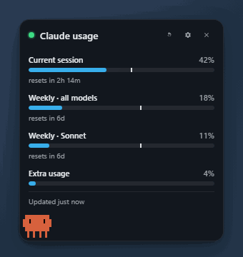
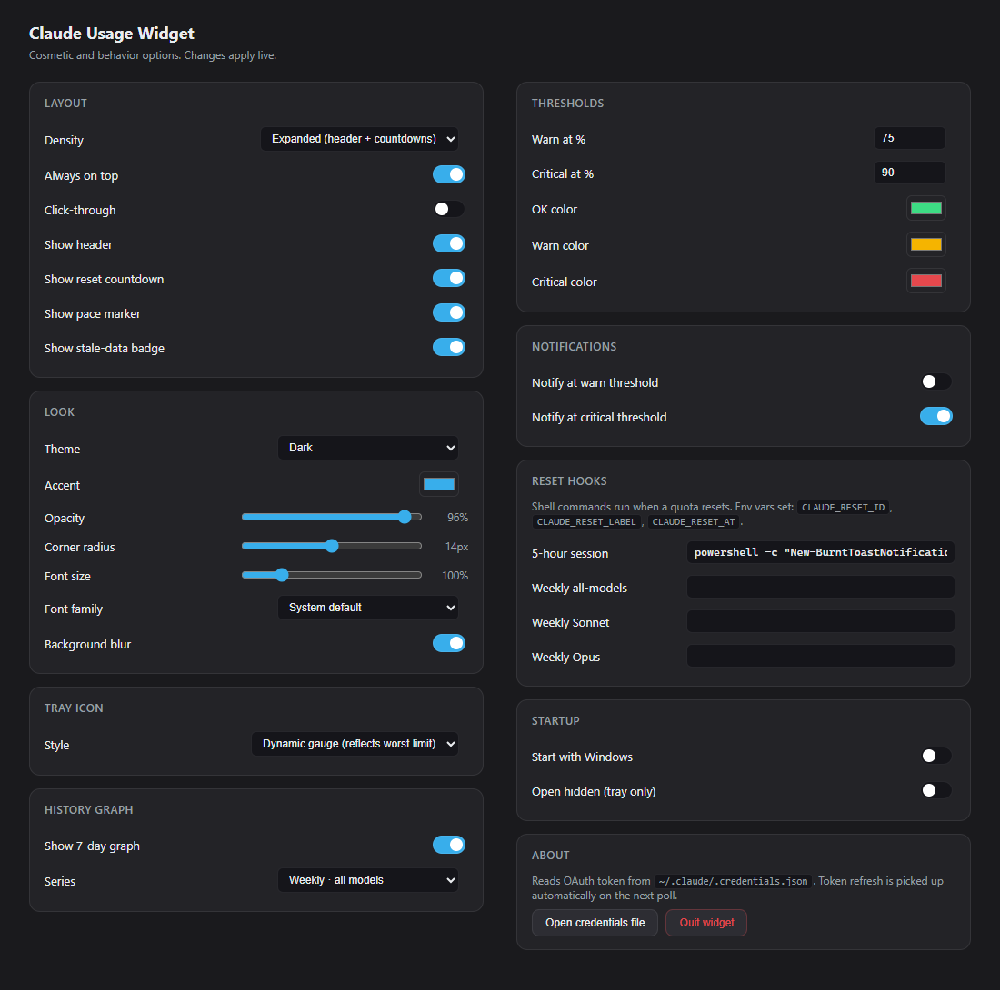
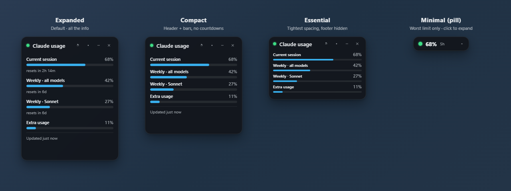
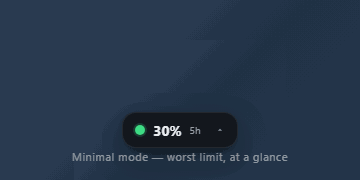
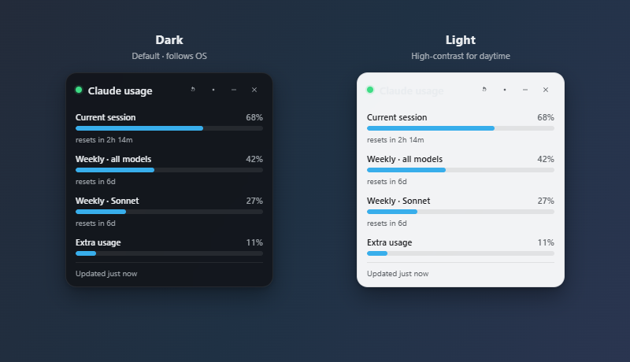
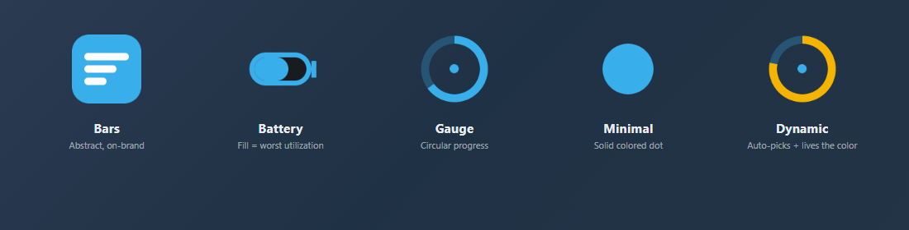
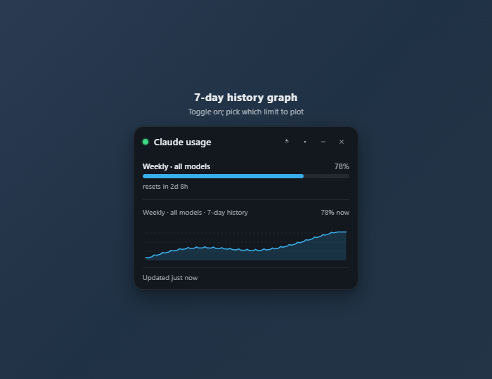
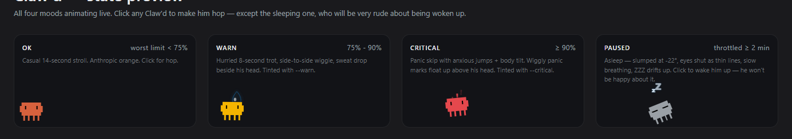
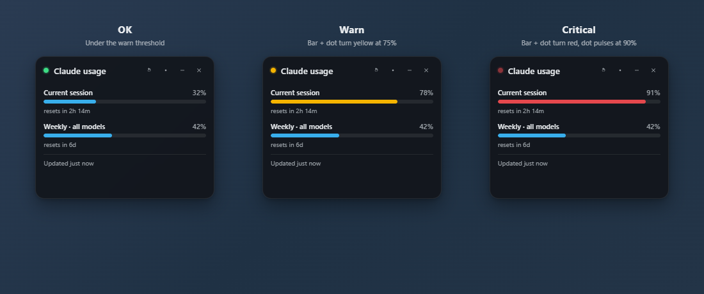

# Claude Usage Widget

> **Este repositório é um fork de [projectvelox/claude-usage-widget](https://github.com/projectvelox/claude-usage-widget).**
> O objetivo deste fork é adicionar suporte a múltiplos idiomas com foco em **Português (Brasil)**.
> A interface, menus da bandeja do sistema, notificações e todas as strings visíveis ao usuário podem ser exibidas em português, sem necessidade de nenhuma configuração adicional — basta acessar **Configurações → Idioma → Português (Brasil)**.

---

<p align="center">
  
</p>

**An always-on-top floating widget that shows your claude.ai plan usage in real time, on Windows.** Built specifically around the OAuth token Claude Code already keeps on your machine, so it cannot be broken by Cloudflare changes that take down cookie-scraping trackers.

## Idiomas / Languages

Este fork adiciona um sistema de internacionalização (i18n) completo ao projeto original. Os idiomas disponíveis são:

| Idioma | Código | Status |
|---|---|---|
| English | `en` | ✅ Padrão original |
| Português (Brasil) | `pt-BR` | ✅ Tradução completa |

Para trocar o idioma: abra as **Configurações** (ícone de engrenagem no widget) → seção **Idioma** → selecione o idioma desejado. A interface muda imediatamente, sem reiniciar o aplicativo.

**O que é traduzido:**
- Toda a interface do widget (labels, botões, tooltips, estados de erro)
- Janela de configurações completa (seções, labels, opções dos menus)
- Menu do ícone na bandeja do sistema
- Notificações nativas do Windows
- Diálogos de confirmação
- Contagens regressivas e indicadores de tempo
- Frases do mascote Claw'd

➡ **[Download the latest portable .exe](../../releases/latest)** — ~88 MB, single file, no install. Tested on Windows 11.

> First-launch note: the EXE is unsigned (we have applied for free open-source code signing through the [SignPath Foundation](https://signpath.org/) — once accepted, future releases will be signed by SignPath Foundation's certificate at no cost). SmartScreen will say "Windows protected your PC." Click **More info → Run anyway**. One-time click per machine.

> **If your antivirus calls it `Trojan:Win32/Wacatac` or similar:** this is a known false positive that hits every unsigned Electron app (Discord, VS Code, Notion all had it before they signed their builds). The `!ml` suffix on the detection name means it came from Windows Defender's machine-learning heuristic, not a real signature match. To verify the file you have is identical to what I published:
> ```powershell
> Get-FileHash -Algorithm SHA256 .\ClaudeUsageWidget-*.exe
> ```
> and compare against `SHA256SUMS.txt` on the [release page](../../releases/latest). If the hash matches you have the canonical build. The v0.2.17 release binary has already been independently scanned:
>
> - **Portable EXE** (`ClaudeUsageWidget-0.2.17-portable.exe`): [0 / 64 engines detected as malicious](https://www.virustotal.com/gui/file/27fa0046cef6ba50ee670116a067069aaba1513480de4f6fc1b50201b0c3d36f)
> - **Installer EXE** (`ClaudeUsageWidget-0.2.17-setup.exe`): [0 / 68 engines detected as malicious](https://www.virustotal.com/gui/file/de62ec183f7451db66c0f084591e136984b39d19dfabb278113cfba46b1836c3)
>
> Every signature-based engine on VirusTotal — including Microsoft's own — comes back clean. The Wacatac flag on real Windows machines comes entirely from Defender's cloud-delivered ML model (the `!ml` suffix), which doesn't run on VirusTotal's static scans. To work around it on your machine: Defender → **Virus & threat protection** → **Protection history** → restore + allow. Permanent fix (code signing via SignPath Foundation) is in flight — once it lands, this section goes away.

## What it shows

The same bars as **Settings → Usage** on claude.ai, plus things they don't:

- Current session (5-hour rolling window)
- Weekly · all models / Sonnet / Opus / Cowork — whichever your plan exposes
- Extra usage credits if your plan has a credit pool — with the dollar amount used and the monthly cap (e.g. `$225 of $5,000 used`), not just the percentage
- Reset countdowns per limit
- A **pace marker** on each bar — a vertical line that turns red when you're burning faster than the timer
- An optional 7-day SVG history graph for any limit you pick
- Threshold notifications and shell hooks that fire when a limit resets
- A **pill / minimal mode** that collapses the widget to a tiny ~156×44 capsule showing just the worst-utilized limit %, ideal for non-developers who want ambient awareness without giving up screen real estate
- **Claw'd**, a pixel-art crab mascot that walks the widget's bottom edge and reacts to your usage — strolls when you're fine, panic-skips with "!" marks at critical, sleeps with floating Zs when rate-limited, and gets grumpy if you click him while he's napping
- **In-app update check** — once a day the widget pings GitHub Releases and surfaces a small `↑ v0.2.X` link in the footer when a newer build is out, so you never run a stale version without knowing

## How it's different

> **TL;DR.** It's the only Windows widget that combines the Cloudflare-immune OAuth auth path with an always-on-top floating UX, a 7-day history graph, multiple tray icon styles, per-quota reset hooks, and a snapshot-tested parser.

| Feature | This | jens-duttke | SlavomirDurej | thanoban | Usage4Claude | ClaudeMeter |
|---|:---:|:---:|:---:|:---:|:---:|:---:|
| OS | Win | Win | Win/Mac/Linux | Win | macOS | macOS |
| OAuth Bearer auth (Cloudflare-immune) | ✅ | ✅ | ❌ | ❌ | ❌ | ❌ |
| Always-on-top floating widget | ✅ | ❌ tray | ✅ | ❌ tray | ❌ menu bar | ❌ menu bar |
| 7-day history graph | ✅ | ❌ | ✅ | ❌ | ❌ | ❌ |
| Multiple tray icon styles | 4 + dynamic | 1 | 1 | 1 | 1 | 6 |
| Dynamic tray icon (reflects live state) | ✅ | ❌ | ❌ | ❌ | ❌ | partial |
| Per-quota reset shell hooks | ✅ | ✅ | ❌ | ❌ | ❌ | ❌ |
| Configurable warn + critical thresholds with per-state colors | ✅ | partial | ✅ | ❌ | ✅ | ✅ |
| Desktop notifications at thresholds | ✅ | ❌ | ❌ | ❌ | ❌ | ✅ |
| Adaptive polling (active / idle / deep idle / locked) | ✅ | ✅ | ❌ | ❌ | ✅ | ❌ |
| Reset-aligned refresh (bar zeroes the instant the window rolls) | ✅ | ✅ | ❌ | ❌ | ❌ | ❌ |
| Snapshot tests for the API response shape | ✅ | ❌ | ❌ | ❌ | ❌ | ❌ |
| Codex / other-provider support | planned | ❌ | ❌ | ❌ | ✅ | ❌ |

Built from the lessons learned across all of the above. Borrowed patterns:

| Pattern | From |
|---|---|
| OAuth Bearer from `~/.claude/.credentials.json` | jens-duttke/usage-monitor-for-claude |
| Adaptive polling tiers + 10 s manual-refresh debounce | jens-duttke + f-is-h/Usage4Claude |
| Honor `Retry-After`, exponential backoff, stale-data badge | jens-duttke |
| Re-read credentials on 401 (picks up token refreshes from other Claude Code sessions) | this project |
| Always-on-top re-assertion every 30 s | niccolo-sabato/claude-usage-widget |
| "Essential" compact layout | niccolo-sabato |
| Light/Dark/System theming, draggable header, circular countdowns | SlavomirDurej/claude-usage-widget |
| Configurable warn/critical thresholds + native notifications | eddmann/ClaudeMeter |
| Pace marker / burn-rate indicator | jens-duttke + eddmann |
| `on_reset_command` shell hook per quota | jens-duttke |
| Multiple tray icon styles | eddmann/ClaudeMeter |

What we explicitly **avoided**:

- DPAPI Chrome cookie SQLite reads (thanoban) — breaks on every Chrome key rotation.
- Hitting `claude.ai` directly from Node — Cloudflare blocks the runtime's TLS fingerprint.
- Hardcoding three quota types — the OAuth endpoint returns a dynamic set; we iterate.

## Install

You need [Claude Code](https://claude.com/claude-code) installed and logged in either way, because the widget reads the OAuth token it maintains at `~/.claude/.credentials.json`.

### Windows — download the EXE

1. Download the latest **portable .exe** from [Releases](../../releases/latest).
2. Double-click it. SmartScreen → **More info → Run anyway**.
3. Right-click the tray icon for options, or click the cog inside the widget for the full settings panel.

### macOS, Linux, or anyone who'd rather build from source

You already have the perfect tool to set this up: your own Claude Code. Paste the prompt below into a Claude Code session and let it handle the install. Works on macOS (Apple Silicon and Intel), Linux, and Windows.

````
Set up the Claude Usage Widget from https://github.com/projectvelox/claude-usage-widget on this machine.

1. Clone the repo into ~/Applications/claude-usage-widget (create the parent
   directory if needed; on Linux feel free to use ~/.local/share instead).
2. Run `npm install` in that directory.
3. Run `npm start` and confirm the floating widget appears in a corner of my
   screen. If it does, leave it running.
4. If I ask for a redistributable binary, run `npm run build:mac` (macOS),
   `npm run build:linux` (Linux), or `npm run build` (Windows) and tell me
   the path of the artifact under dist/.

If Node 18+ is not installed, install it via Homebrew (macOS) or my system
package manager (Linux) after asking permission. Do not modify shell rc
files. The widget reads ~/.claude/.credentials.json, so once it launches
it should start showing live usage within ~60 seconds.
````

After the first run, you can use whichever pattern you prefer for re-launching:

- macOS: double-click the built `.app` (inside the `.dmg`), or `npm start` from the cloned dir.
- Linux: run the `.AppImage`, or `npm start` from the cloned dir.
- Windows: double-click the portable `.exe`, or `npm start` from the cloned dir.

To make it auto-launch with your OS: open the widget, click the settings cog → **Startup → Start with [OS]**.

### For developers

```powershell
git clone https://github.com/projectvelox/claude-usage-widget
cd claude-usage-widget
npm install
npm start
```

**Branch model.** `main` is the production branch — every tag-push there cuts a public release. `dev` is the working branch where day-to-day commits land. Pushing to `dev` runs the full test suite and, if green, opens (or updates) a single "Promote dev → main" PR. Merging that PR is the only path code takes into production.

```powershell
git checkout dev                       # work here
# edit, commit
git push origin dev                    # CI runs tests, opens promote PR if green

# when you're ready to release:
gh pr merge <PR#> --merge              # promote dev → main
git checkout main; git pull
npm version patch                      # bumps + tests + tags + pushes; CI builds + publishes
```

`npm version` runs `npm test` before bumping (preversion hook) and `git push --follow-tags` after (postversion hook), so a single command takes you from "I have a fix on main" to "release is live."

```powershell
npm test                 # parser snapshot tests + updater semver tests + display geometry tests
npm run icons            # regenerate the tray + window icons
npm run demo-gif         # regenerate assets/demo.gif (main demo)
npm run pill-gif         # regenerate assets/demo-pill.gif (minimal mode demo)
npm run layouts-png      # regenerate assets/layouts.png (layout comparison)
npm run trays-png        # regenerate assets/trays.png (tray icon styles)
npm run themes-png       # regenerate assets/themes.png (dark vs light)
npm run thresholds-png   # regenerate assets/thresholds.png (OK / warn / critical)
npm run history-png      # regenerate assets/history.png (7-day graph showcase)
npm run settings-png     # regenerate assets/settings.png (full settings panel)
npm run mascot-preview   # regenerate assets/claw-d.png + per-mood capture frames
npm run og-image         # regenerate the 1280x640 social-preview PNG
npm run build            # portable EXE in dist/
npm run build:installer  # NSIS one-click installer in dist/
```

## Make it yours

The widget is built to disappear into your workflow. Almost every part of how it looks, where it sits, and when it interrupts you is configurable from the settings cog — no config-file editing required.

<p align="center">
  
</p>

<p align="center">
  
</p>

### Layout

Four density modes, swap any time from the header chevron or settings:

- **Expanded** — the full experience: header, bars, reset countdowns, pace markers, optional history graph.
- **Compact** — header + bars, countdowns hidden. Saves vertical space.
- **Essential** — tightest spacing, footer hidden, smaller fonts. (Pair with the "Hide header" toggle if you want bars-only with no chrome at all.)
- **Minimal (pill)** — single capsule showing the worst-utilized limit's % and severity color. ~156×44 px. Click the chevron inside the pill to expand back. Designed for **non-developers who want ambient awareness without giving up screen real estate**.

  <p align="center">
    
  </p>

Plus: always-on-top, optional click-through (let clicks pass through the widget), show/hide header, pace marker, stale badge, reset countdown toggle.

### Look

<p align="center">
  
</p>

- **Theme:** System / Dark / Light, follows OS by default.
- **Accent color:** pick any hex — recolors the bars, dots, and gauge.
- **Opacity:** 40 – 100 % so the widget can sit unobtrusively over other windows.
- **Corner radius:** 0 – 28 px (sharp corners to fully rounded).
- **Font scale:** 85 – 160 %, plus optional custom font family.
- **Background blur:** toggle the glass-blur backdrop on systems where it's expensive.

### Tray icon

<p align="center">
  
</p>

Five styles, all redraw live as your usage changes:

- **Bars** — three stacked bars, abstract but on-brand.
- **Battery** — fill level mirrors your worst utilization, just like a phone battery.
- **Gauge** — circular progress arc.
- **Minimal** — solid colored dot, severity-tinted.
- **Dynamic** — picks the right representation automatically and colors it by the live worst-limit severity.

### History graph

<p align="center">
  
</p>

Toggle on/off. Pick any single limit to plot (all-models, Sonnet, Opus, session, or extra) — 7 days of samples, drawn as a smooth SVG sparkline inside the widget body.

### Claw'd, the resident crab

<p align="center">
  
</p>

A pixel-art crab inspired by the Claude mascot, recreated as a tiny SVG that ships with the code (no bundled assets). He walks back and forth along the widget's bottom edge and his mood mirrors your worst limit:

| Mood | Trigger | What he does |
|---|---|---|
| **ok** | worst limit < 75% | Casual 14-second stroll. Anthropic orange. |
| **warn** | 75% – 90% | Hurried 8-second trot with a side-to-side wiggle. Tinted with your `--warn` color. A blue sweat drop beads above his head. |
| **critical** | ≥ 90% | Panic-skip — 4-second fast run with intermittent anxious jumps and body tilt. Tinted with `--critical`. Three red "!" marks float up and fade. |
| **paused** | rate-limited ≥ 2 min | Asleep. Body slumped at -22°, eyes closed as thin lines, slow breathing, three staggered Zs (small → large) drift up from his head. |

He also reacts to interaction:

- **Click him** to make him hop (squish-jump-land in 0.45s).
- **Click him while he's sleeping** and you get a random grumpy speech bubble (`"5 more minutes…"`, `"Hmph."`, `"Rude."`, etc.) instead of a hop. He goes back to sleep after 2 seconds.
- When a quota actually resets, he stops walking and waves side-to-side for ~1.6s before resuming.

Toggle him on/off in **Settings → Layout → "Show Claw'd"**. Hidden automatically in pill and essential layouts where there's no room.

Open [`assets/claw-d-states.html`](assets/claw-d-states.html) in a browser to see all four moods animating side-by-side with interactive buttons — no app launch required.

### Thresholds & notifications

<p align="center">
  
</p>

- **Warn %** and **Critical %** (defaults: 75 / 90) — controls when bars change color and when notifications fire.
- **Per-state colors** for OK / warn / critical — fully customizable.
- **Native desktop notifications** at warn level (optional) and critical level (on by default).

### Reset hooks (power-user)

Run any shell command when a specific quota window rolls over. The command gets these env vars:

- `CLAUDE_RESET_ID` — which limit reset (e.g., `seven_day_sonnet`)
- `CLAUDE_RESET_LABEL` — the human-readable label
- `CLAUDE_RESET_AT` — the new reset timestamp

Useful for: piping a notification to Slack, triggering a "fresh start" script, kicking off a batch job that was waiting on quota.

### Startup

- **Start with Windows** — registers the widget as a login item.
- **Open hidden** — launch straight to the system tray, no widget popup on boot.

---

Config persists to `%APPDATA%\claude-usage-widget\config.json`; history samples to `%APPDATA%\claude-usage-widget\history.json`.

## Auth — and what we don't touch

The widget reads the OAuth access token that Claude Code already maintains. There is no separate login, no browser cookie scraping, no Cloudflare hassle.

If the token expires:

1. The widget shows an `auth` badge.
2. On the next poll, it re-reads the credentials file. If Claude Code (or another concurrent Claude session) has refreshed the token, the new value is used immediately.
3. If the token is truly expired, run `claude` in a terminal to refresh, and the widget catches up on the next poll.

The token is sent only to `https://api.anthropic.com/api/oauth/usage` — Anthropic's official endpoint, and nothing else. See [SECURITY.md](SECURITY.md) for the full statement.

## File layout

```
src/
  main.js       Electron main process, IPC, tray, login items, reset hooks
  preload.js    Sandboxed bridge between renderer and main
  usage.js      OAuth Bearer fetch, normalize, auth-retry on 401
  poller.js     Adaptive polling, reset detection, backoff
  history.js    Append-only sample store, 7-day trim
  config.js     Persisted settings + deep merge
  icon.js       Pure-Node PNG encoder + 4 tray icon styles + dynamic gauge
  updater.js    Daily check against GitHub Releases, semver compare, footer badge feed
  geom.js       Pure rect-overlap helpers for rescuing the widget when a monitor disconnects
renderer/
  widget.html / .css / .js     Always-on-top floating widget + SVG history graph
  settings.html / .css / .js   Live-editing settings panel
  demo.html                    Self-contained widget clone for GIF capture
  demo-pill.html               Self-contained pill-mode clone for the pill GIF
assets/
  claw-d-states.html           Self-contained Claw'd mood preview (open in any browser)
tests/
  normalize.test.js   Snapshot tests against the live response shape
  updater.test.js     Semver parsing + comparison for the GitHub Releases check
  geom.test.js        Display-rect overlap math (monitor disconnect rescue)
scripts/
  launch.js             Strips ELECTRON_RUN_AS_NODE before spawning the GUI
  build-icon.js         Pre-bakes tray + window + preview icons
  build-demo-gif.js     Headless Electron capture + gifenc → assets/demo.gif
  build-pill-gif.js     Same pattern → assets/demo-pill.gif (minimal mode)
  build-layouts-png.js  Side-by-side layout showcase → assets/layouts.png
  build-trays-png.js    Five tray icon styles, captioned → assets/trays.png
  build-themes-png.js   Dark vs light theme comparison → assets/themes.png
  build-thresholds-png.js  OK/warn/critical severity comparison → assets/thresholds.png
  build-history-png.js     Widget + 7-day history graph → assets/history.png
  build-settings-png.js    Two-column shot of the live settings panel → assets/settings.png
  capture-mascot-preview.js  Headless Electron capture → assets/claw-d.png + per-mood frames
  build-og-image.js     Headless Electron capture → assets/og-image.png (social card)
.github/
  workflows/release.yml        Builds the portable EXE on tag push
  ISSUE_TEMPLATE/              Bug + feature templates
```

## Roadmap

- Multi-account / multi-org switcher (cross-cutting top demand)
- Codex usage alongside Claude (Usage4Claude has this, we want it)
- Burn-down projection line on the history graph ("at this rate, you hit 100% by Thu 6 pm")
- Mac and Linux builds in the same CI workflow
- Signed Windows binary via [SignPath OSS](https://signpath.io/)
- `winget install` distribution

See [open issues](../../issues) for the current state.

## Changelog

[CHANGELOG.md](CHANGELOG.md) is auto-regenerated from git history on every push to `main` by [`.github/workflows/changelog.yml`](.github/workflows/changelog.yml). Per-release notes (with download links and the SmartScreen blurb) live on the [Releases page](../../releases).

## Contributing

PRs welcome — please skim [CONTRIBUTING.md](CONTRIBUTING.md) first. Security issues go through [SECURITY.md](SECURITY.md), not the public issue tracker.

## License

[MIT](LICENSE).
